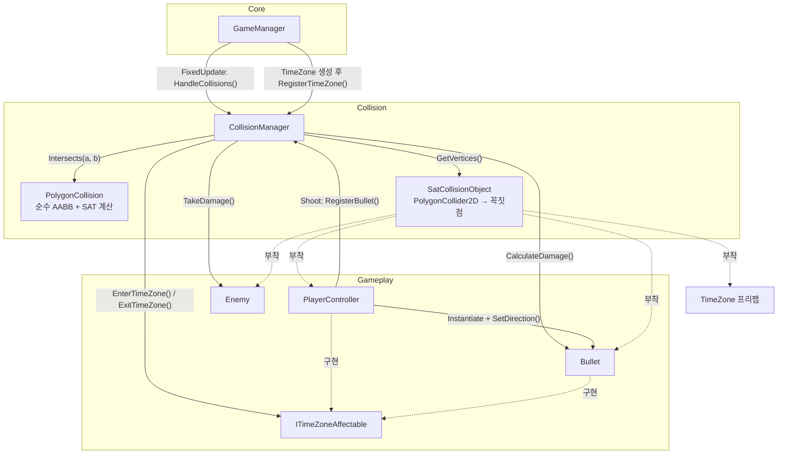
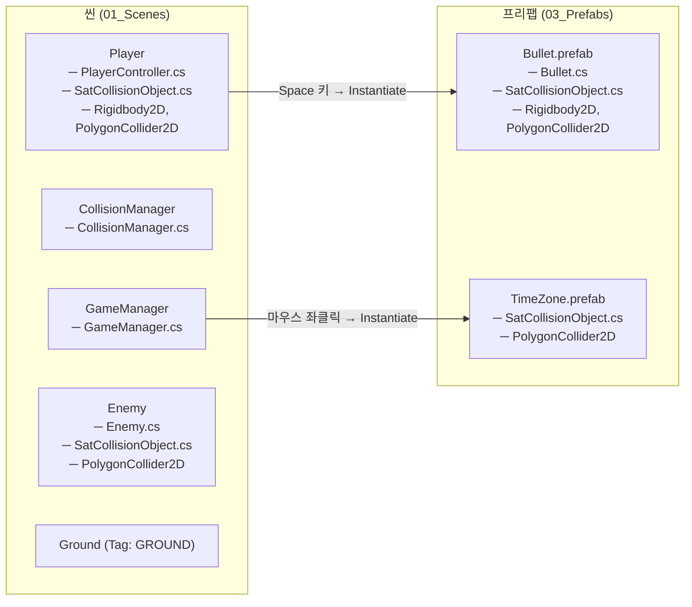
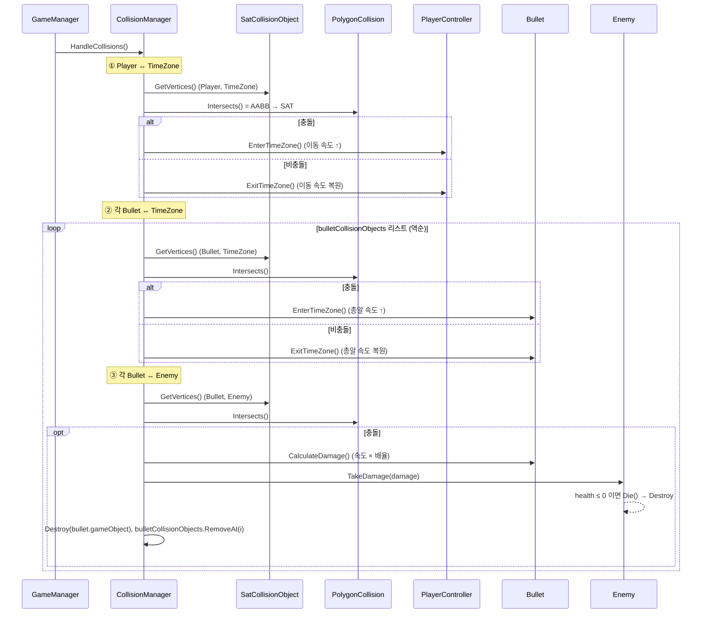
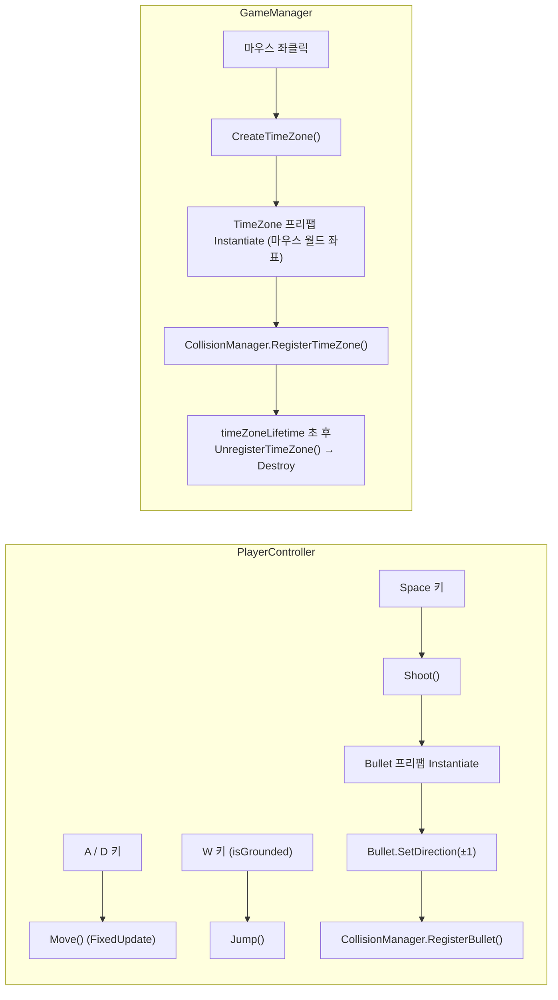
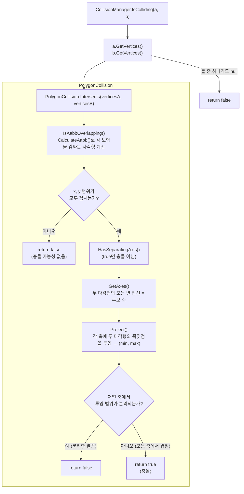

# 스크립트 구조도 (02_Scripts)

AABB + SAT 기반 자체 충돌 처리 프로젝트의 스크립트 구성과 호출 흐름을 정리한 문서입니다.
(다이어그램은 Mermaid 문법으로, GitHub / VS Code / Obsidian 등에서 바로 렌더링됩니다.)

---

## 1. 스크립트 한눈에 보기

```
02_Scripts/
├── Core/        GameManager.cs
├── Collision/   CollisionManager.cs, PolygonCollision.cs, SatCollisionObject.cs
└── Gameplay/    ITimeZoneAffectable.cs, PlayerController.cs, Bullet.cs, Enemy.cs
```

| 폴더 | 스크립트 | 구분 | 역할 (1줄 요약) |
|---|---|---|---|
| Core | `GameManager.cs` | 매니저 (싱글톤) | 마우스 클릭으로 TimeZone을 생성(및 일정 시간 후 제거)하고, 충돌 로직을 제외한 게임 흐름 전반의 로직을 담당(예정)한다. |
| Collision | `CollisionManager.cs` | 매니저 (싱글톤) | 충돌 가능한 오브젝트(Player/Enemy/TimeZone/Bullet)를 등록·관리하고, 매 물리 프레임 충돌 여부를 판정해 그 결과(TimeZone 진입/이탈, 피격)를 각 오브젝트에 전달한다. |
| Collision | `PolygonCollision.cs` | 정적 클래스 (순수 계산) | 볼록 다각형 두 개의 충돌 여부를 AABB(가능성 검사) → SAT(정밀 검사) 순서로 판정한다. Unity 오브젝트에 의존하지 않는다. |
| Collision | `SatCollisionObject.cs` | 컴포넌트 (공용) | 오브젝트의 PolygonCollider2D에서 꼭짓점을 월드 좌표로 추출하여, 충돌 연산에 필요한 정보를 CollisionManager에 제공한다. |
| Gameplay | `ITimeZoneAffectable.cs` | 인터페이스 | TimeZone 안에 들어가면 영향을 받는 오브젝트(Player, Bullet)의 공통 인터페이스. |
| Gameplay | `PlayerController.cs` | 컴포넌트 (Player) | 플레이어의 이동·점프·총알 발사 등 기본 조작과, TimeZone 진입/이탈 시 이동 속도 변경 로직을 담당한다. |
| Gameplay | `Bullet.cs` | 컴포넌트 (Bullet) | 총알의 이동·속도 관리 및 TimeZone 진입/이탈 시 속도 변경과 속도 기반 데미지 계산을 담당한다. |
| Gameplay | `Enemy.cs` | 컴포넌트 (Enemy) | 적의 체력을 관리하고, 데미지를 입거나 체력이 0 이하가 되어 죽는 로직을 담당한다. |

---

## 2. 스크립트 의존 관계도

실선: "A가 B의 메서드를 호출한다" / 점선: 구현·부착 관계



> TimeZone 진입/이탈 처리에서 `CollisionManager`는 `ITimeZoneAffectable`만 사용하므로 Player/Bullet의 Enter/Exit 구현을 몰라도 됩니다. (피격 처리 `TryHitEnemy`에서는 `Bullet`/`Enemy` 구체 타입을 사용합니다.)

---

## 3. 씬 오브젝트 / 프리팹 구성



> `CollisionManager`의 `playerCollisionObject` / `enemyCollisionObject`는 `[SerializeField]`로 **인스펙터에서 직접 할당**합니다.
> `timeZoneCollisionObject`와 `bulletCollisionObjects`는 런타임에 `RegisterTimeZone()` / `RegisterBullet()`으로 등록되고, TimeZone은 만료 시 `UnregisterTimeZone()`으로 해제됩니다.

---

## 4. 런타임 흐름

### 4-1. 매 물리 프레임(FixedUpdate) 충돌 처리 흐름



### 4-2. 입력 → 오브젝트 생성 흐름



---

## 5. 충돌 판정 파이프라인 (`CollisionManager.IsColliding` → `PolygonCollision.Intersects`)



- **1단계 AABB**: 비용이 싼 사각형 겹침 검사로 충돌 가능성이 없는 쌍을 빠르게 걸러냅니다.
- **2단계 SAT**: AABB를 통과한 쌍만 볼록 다각형 정밀 검사를 수행합니다.
- `PolygonCollision`은 `Vector2[]`만 받는 순수 함수라, Unity 씬 없이도 단위 테스트가 가능합니다.

---

## 6. 스크립트별 주요 멤버

### `GameManager.cs`
| 멤버 | 설명 |
|---|---|
| `Instance` | 싱글톤 인스턴스 |
| `timeZonePrefab`, `timeZoneLifetime` | 생성할 TimeZone 프리팹, 유지 시간(초) (인스펙터) |
| `Update()` | 마우스 좌클릭 감지 → `CreateTimeZone()` |
| `FixedUpdate()` | `CollisionManager.Instance.HandleCollisions()` 호출 |
| `CreateTimeZone()` | 마우스 위치에 TimeZone 생성, `SatCollisionObject` 보장, CollisionManager에 등록 |
| `CoDestroyTimeZoneAfter()` | 코루틴: 일정 시간 후 등록 해제(`UnregisterTimeZone()`) 및 파괴 |

### `CollisionManager.cs`
| 멤버 | 설명 |
|---|---|
| `Instance` | 싱글톤 인스턴스 |
| `playerCollisionObject`, `enemyCollisionObject` | 충돌 검사 대상 (인스펙터에서 할당) |
| `timeZoneCollisionObject`, `bulletCollisionObjects` | 충돌 검사 대상 (런타임에 `Register…`로 등록) |
| `RegisterTimeZone()`, `UnregisterTimeZone()`, `RegisterBullet()` | 런타임 대상 등록 / TimeZone 등록 해제 |
| `HandleCollisions()` | 매 물리 프레임 호출. Player·각 Bullet의 TimeZone 상태 갱신 → Bullet↔Enemy 피격 처리 |
| `UpdateTimeZoneState()` | 대상(`ITimeZoneAffectable`)이 TimeZone 안이면 `EnterTimeZone`, 아니면 `ExitTimeZone` |
| `TryHitEnemy()` | Bullet↔Enemy 충돌 시 데미지 적용 후 `true` 반환 (총알 제거는 `HandleCollisions`에서) |
| `IsColliding()` | 두 오브젝트의 꼭짓점을 꺼내 `PolygonCollision.Intersects`에 넘김 |

### `PolygonCollision.cs`
| 멤버 | 설명 |
|---|---|
| `Intersects()` | 유일한 public 진입점. `IsAabbOverlapping && !HasSeparatingAxis` |
| `IsAabbOverlapping()`, `CalculateAabb()` | 감싸는 사각형 계산 및 겹침 검사 |
| `HasSeparatingAxis()`, `Project()` | 각 축에 투영 → 분리축 탐색 |
| `GetAxes()`, `AddEdgeNormals()` | 후보 축 목록 생성 (두 도형의 모든 변 법선) |
| `AxisAlignedBoundingBox` (struct) | `min`, `max` + `Overlaps()` — AABB 겹침 판정 |
| `Projection` (struct) | 한 축에 투영된 `[min, max]` 범위 + `Overlaps()` |

### `SatCollisionObject.cs`
| 멤버 | 설명 |
|---|---|
| `polygonCollider` | 부착된 `PolygonCollider2D` |
| `GetVertices()` | 로컬 꼭짓점을 `TransformPoint`로 월드 좌표 변환해 `Vector2[]`로 반환 (콜라이더 없으면 `null`) |

### `ITimeZoneAffectable.cs`
| 멤버 | 설명 |
|---|---|
| `EnterTimeZone()` / `ExitTimeZone()` | TimeZone 진입/이탈 시 호출. 매 물리 프레임 반복 호출돼도 안전해야 함 (구현: `PlayerController`, `Bullet`) |

### `PlayerController.cs`
| 멤버 | 설명 |
|---|---|
| `moveSpeed`, `timeZoneSpeed` | 기본 / TimeZone 내 이동 속도 (인스펙터) |
| `currentSpeed` | 현재 적용 중인 이동 속도 (런타임 상태) |
| `GroundTag`, `DefaultGravityScale` | 상수: 접지 태그 `"GROUND"`, 기본 중력 배율 `1` |
| `jumpForce`, `fallMultiplier`, `jumpMultiplier` | 점프력, 하강·상승 시 중력 배율 |
| `Update()` / `FixedUpdate()` | 입력 수집 / 물리 적용(`Move`, `Jump`, `ApplyBetterJumpGravity`, `Shoot`) |
| `Shoot()` | 총알 생성, 방향 전달, CollisionManager에 등록 |
| `EnterTimeZone()` / `ExitTimeZone()` | `ITimeZoneAffectable` 구현. 이동 속도 증가 / 복원 |
| `Flip()`, `OnCollisionEnter2D()` | 좌우 반전, `GROUND` 태그 접지 판정 |

### `Bullet.cs`
| 멤버 | 설명 |
|---|---|
| `RightDirection`, `LeftDirection` | 발사 방향 상수 (`+1`, `-1`) |
| `bulletSpeed`, `timeZoneSpeed` | 기본 / TimeZone 내 속도 (인스펙터) |
| `currentSpeed` | 현재 적용 중인 속도 (런타임 상태) |
| `damageMultiplier` | 속도 기반 데미지 배율 |
| `MoveBullet()` | `Rigidbody2D.velocity`에 방향 × 속도 적용 |
| `EnterTimeZone()` / `ExitTimeZone()` | `ITimeZoneAffectable` 구현. 속도 증가 / 복원 |
| `SetDirection()` | 발사 방향(±1) 설정. `Start()`의 첫 이동에 쓰이므로 Instantiate 직후 같은 프레임에 호출 |
| `CalculateDamage()` | `현재 속도 크기 × damageMultiplier` 반환 |

### `Enemy.cs`
| 멤버 | 설명 |
|---|---|
| `health` | 체력 |
| `TakeDamage()` | 체력 감소, 0 이하이면 `Die()` |
| `Die()` | 오브젝트 파괴 |

---

## 7. 코드 스타일

저장소 루트의 `.editorconfig`가 포맷 규칙을 정의합니다 (Rider / VS / VS Code가 자동으로 읽음).

| 항목 | 규칙 |
|---|---|
| 중괄호 | 문장 끝에 붙임 (K&R), else는 `} else {`. guard clause(`if (...) return;` / `continue;`)만 한 줄로 생략하고, 그 외 분기는 한 문장이라도 항상 중괄호 |
| 들여쓰기 | 스페이스 4칸. 4단계 이상 중첩되면 함수로 분리 |
| namespace | 모든 스크립트는 `CollisionDetection` 네임스페이스 안에 둠 |
| 네이밍 | 타입·메서드·상수 `PascalCase`, 필드·지역변수·매개변수 `camelCase`, 인터페이스 `I` 접두사, 코루틴 `Co` 접두사, Unity 콜백 `On` 접두사 |
| 약어 | 사용하지 않음 (`rb` → `rigidBody`). 단어로 쓰인 약어는 PascalCase (`Sat`, `Aabb`) |
| bool | `is` / `has` 접두사 (`isGrounded`, `isJumpRequested`) |
| 메서드 이름 | 동사로 시작 (`CalculateAabb`, `HasSeparatingAxis`, `TryHitEnemy`) |
| 레퍼런스 매개변수 | 메서드 진입 시 `Assert.IsNotNull` 로 확인 (null이 유효한 입력인 경우는 주석으로 명시) |
| 상수 | 매직 넘버 대신 `const` (`LeftMouseButton`, `DefaultGravityScale`, `RightDirection`) |
| 자료형 | 튜플 대신 struct (`AxisAlignedBoundingBox`, `Projection`) |
| 인스펙터 노출 필드 | `[SerializeField] private` + `[Header]` / `[Tooltip]`. 이름 변경 시 `[FormerlySerializedAs]`로 저장 값 보존 |
| 주석 | 코드가 말하는 "무엇"은 쓰지 않고, 코드만 봐서는 모르는 "왜"만 남김. 필요 없는 코드는 주석 처리하지 않고 삭제 |
